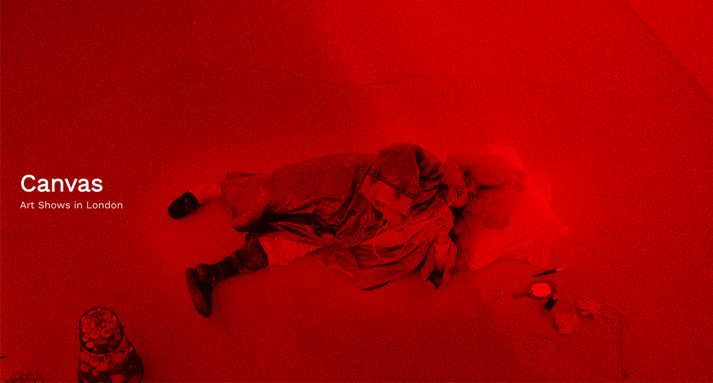
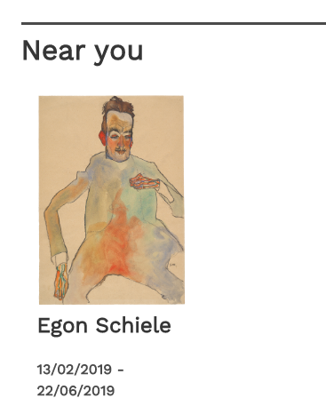
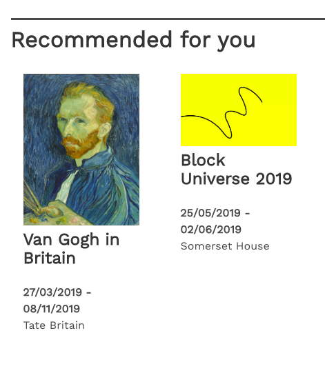
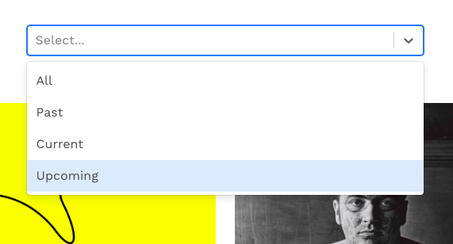
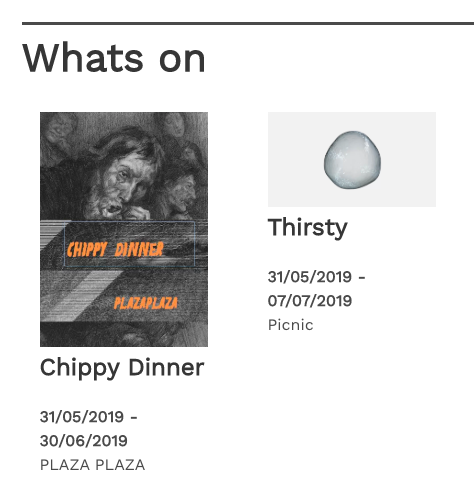
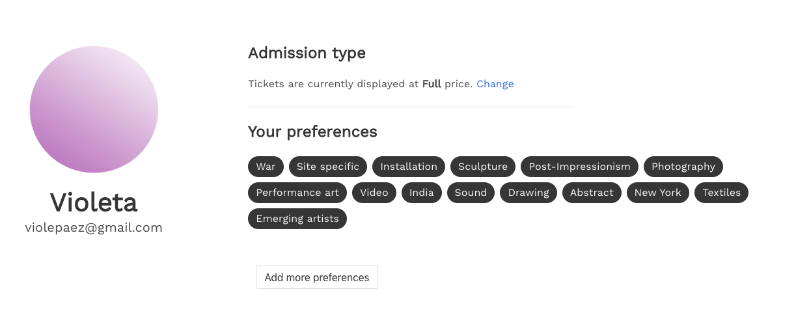
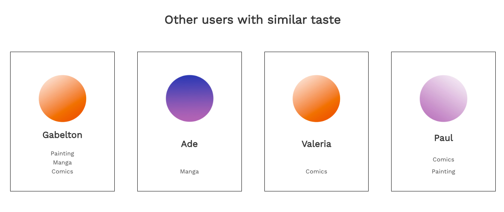
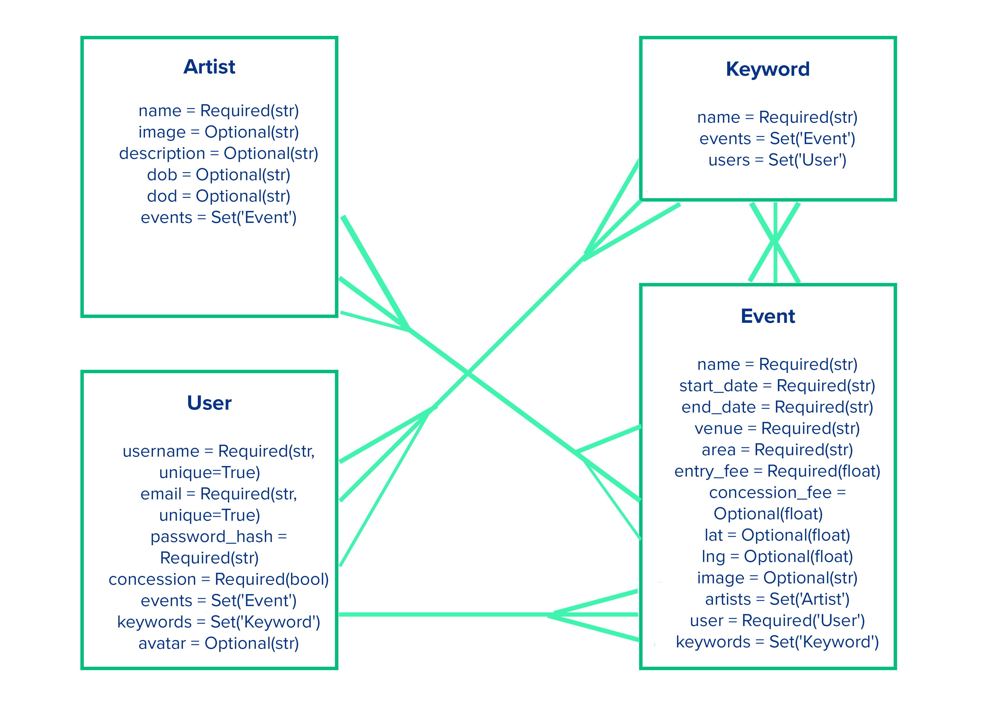

# Canvas
## Art shows in London




Canvas showcases art exhibitions and events in London, based on user preferences and location.

[Link to Live Website](https://canvas-london.herokuapp.com)

## Timeframe
7 days

## Technologies used

* React
* PostgreSQL
* Bulma
* SCSS
* Webpack
* Pipenv and yarn
* Git
* Ajax
* Python
* Flask
* PonyORM
* Marshmallow
* OpenCage API
* Mapbox API


## Installation

* Clone or download the repo
* `yarn` and `pipenv install` to install dependencies
* `createdb art-london` to create database using postgress
* `yarn run server` to run backend
* `yarn run client` to run front-end


## Introduction

Week long project in collaboration with [Gabe Naughton](https://github.com/gabelton).

At university we both came into regular contact with the art world. London possesses a dizzying range of galleries and events. Sometimes sifting through these different options can feel a touch overwhelming. Working as part of a pair, we designed an app to help users filter art events around the city, making use of a ‘keywords’ model to connect users with similar taste and to provide tailored recommendations based on their interests.

We separated our responsibilities into back end and front end and switched regularly. I mainly focused on everything user related.

In the backend, using Python and Flask, I built the user controller, to retrieve and edit users’ details and preferences. I also made a separate contacts controller that matches the logged in user with other users with similar taste using our 'keywords' model.
In the front end, using React, I made the user profile page that displays personal information, users with similar tastes, and allows the user to change their preferences. I’ve also worked on a recommended for you exhibition list, a showcase of exhibitions based on the user’s set preferences.


## Tailored Results

The different exhibition lists on canvas are customised based on the user's location and preferences.


## Based on location


This section required us to carefully rethink our initial approach and adopt a new strategy. At first we had tried to handle requests from the front end only, though we began to realise that this was an inefficient system, which quickly consumed Opencage API requests. At this point we opted to set location as a property in the backend, the first time we had used ‘before_insert’ and ‘before_update’ hooks, and to write conditions in Python to check that the requests had been successful.

```
def geolocate(record):
    params = {
        'q': record.venue,
        'key': os.getenv('OPENCAGE_KEY')
    }
    try:
        res = requests.get('https://api.opencagedata.com/geocode/v1/json', params)
        print(res)
        json = res.json()


        if json['results']:

            record.lat = json['results'][0]['geometry']['lat']
            record.lng = json['results'][0]['geometry']['lng']
        else:
            record.lat = 51.509865
            record.lng = -0.118092
```

## Based on user's preferences



The user has associated keywords (preferences that they set when registering or in their profile page) stating their taste in art (performance art, painting, photography). On componentDidMount, we made an axios request to our own API to fetch the user's preferences (this.state.keywords) and the exhibitions (this.state.exhibitions). The function matchedEvents checks and filters any exhibition that matches any of the user's keywords. We had to use an includes() function within the filter because the user can have many keywords and the exhibitions can have many keywords as well.


```
matchedEvents(){

  const exhibitions = this.state.exhibitions
  return exhibitions.filter(exhibition => {
    const match = exhibition.keywords.filter(keyword =>{
      if(this.state.keywords.includes(keyword.id)) return keyword
    }).length
    if(match) return exhibition
  })
}

```

## Based on date



This section was somewhat challenging because we had not worked with dates in Python before. We had to import functionality from datetime in our seeds file before employing the strftime() method. On the frontend we then had to translate this string into a format JavaScript recognised as a date before parsing this date, so that we could compare different results and filter according to whether they were past, current or upcoming exhibitions using React Select.



```
function whatsOn(arr) {
  return arr.filter(exhib => {

    const startSplitDate = exhib.start_date.split('/')
    const startMonth = startSplitDate[1] - 1
    const startDate = new Date(startSplitDate[2], startMonth, startSplitDate[0])

    const endSplitDate = exhib.end_date.split('/')
    const endMonth = endSplitDate[1] - 1
    const endDate = new Date(endSplitDate[2], endMonth, endSplitDate[0])

    const startParsed = Date.parse(startDate)
    const endParsed = Date.parse(endDate)
    const currentParsed = Date.parse(new Date())

    if (currentParsed > startParsed && currentParsed < endParsed ){
      return exhib
    }
  })
}
```


## User Profile




Because customisation based on the user was really important to our project, we dedicated a substantial amount of time to develop a user profile page.
The user can edit their profile information, ticket type (concession or full price) and set new preferences.


When the user edits any part of their profile, a put request is made to our API.


There was two specifically challenging cases we had to work with: the user setting new preferences(keywords) and the user changing ticket type.

### Setting new preferences: the keyword model

The keywords are a list of referenced data, so we would send the request in json as ids that would then get populated in post_load with the corresponding keyword's data.

With this structure, when the user set new preferences(or keywords) it would just replace the existing ones with the new.

However, we wanted for them to be added to the existing ones rather than overwriting them. We had to create a new list that concatenated the previous keywords of the current user with the new keywords before updating the user.

```
    if data.get('keyword_ids'):
        print(g.current_user.keywords)
        previousKeywords = []
        for keyword in g.current_user.keywords:
            previousKeywords.append(keyword)
        data['keywords'] = [Keyword.get(id=keyword_id) for keyword_id in data['keyword_ids']] + previousKeywords
        del data['keyword_ids']
    g.current_user.set(**data)
    db.commit()
    user_info = g.current_user
    return schema.dumps(user_info)
```


### Changing ticket type: converting JSON string to Python boolean

In the backend model, the ticket type was a boolean set to True or False. If the user wanted tickets at concession price displayed, it would be true.
We were sending the put request with a JSON format, which meant that setting it to true or false would send a string, however the backend was expecting a boolean because of the way we set up our model.
This meant that we had to modify the data on post load so when the backend received the JSON request it would set data['concession'] to be a python true or false, before updating the user.

```
if data.get('concession'):
    data['concession'] = data['concession'] == 'true'
```

### Match users with similar interests





Selects all the users except the current one that have a matching keyword.
In the matched users, get the specific keywords that match with the current user.

```
def get_contacts():

    def intersection(listA, listB):
        return list(set(listA) & set(listB))

    users = User.select()
    users = [u for u in users if intersection(u.keywords, g.current_user.keywords) and u != g.current_user]
    print(users)


    def get_keywords(keywords):
        keywords = [{'id': keyword.id, 'name': keyword.name} for keyword in keywords if keyword in g.current_user.keywords]
        return keywords

    users = list(map(lambda user: {'username': user.username, 'matches': get_keywords(user.keywords), 'id': user.id, 'avatar': user.avatar}, users))

    return jsonify({'users': users})
```


## Data model diagram



## Future Features

### Messaging service

Messaging service using a third-party API to connect the user with users with similar taste.

### More accurate map results

There is a small bug with the wrong coordinates being set for the event location, as certain galleries are currently not being recognised by OpenCage API.

When creating a new event, we would like to implement an option for the user to double check the position in the map, before setting the address for the event.

### Incorporating museums API

We would also like to utilise museum APIs to see how these might supplement our artist model.

### Responsiveness

We still need to add classes in Bulma to make certain elements, such as the Navbar, display on mobile. We also need to modify the main image on the homepage, so that it displays fully on a projector or large screen.
